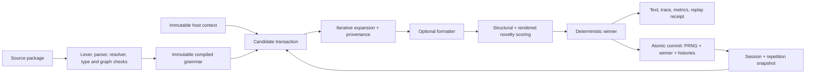

# Mecojoni v2 Specification and Runtime Design

> This document is the target design, not a claim that every feature already
> exists. The portable workspace, complete recovering source parser, immutable
> package compiler, iterative `weighted/1` generator, deterministic primitives,
> typed request/guard/binding runtime, complete-message formatter boundary,
> transactional `diverse/1` sessions and histories, stable provenance, overlap-only
> audits, replay receipts, copy-on-write snapshots, package boundary, handwritten
> WASM ABI, and Deno/browser wrapper are implemented; completion is tracked in
> `ROADMAP.md`.

The syntax in `README.md` is authoritative. `V2_SYNTAX.md` is its formal lexical
companion and `V2_INTERFACES.md` freezes host boundaries. Any syntax change must
update all affected documents in the same change; if they temporarily conflict,
the README wins.

## Design position

Mecojoni has one unusually strong product idea: a readable, deterministic text
grammar whose sampler actively resists perceptible repetition. The current proof
of concept demonstrates that idea well. Its compact syntax, pre-generation graph
validation, seeded output, traces, and novelty-aware selection are worth
preserving.

The prototype is not yet a production dialogue language. Its most important
problems are not missing polish; they are undefined or violated contracts:

- discarded novelty candidates change persistent cooldown state;
- configured recursion limits can lose to the JavaScript call stack;
- audit attribution can identify a rule that emitted none of the repeated text;
- invisible whitespace changes output;
- the language cannot reuse a choice, carry agreement features, or safely accept
  host values;
- localization, stable message identity, fallback, and translation validation do
  not exist;
- the public grammar appears immutable but remains mutable under its wrapper;
- several options, numerical cases, and alternate entries fail outside the
  documented error model.

If designing the system from scratch, I would define Mecojoni as:

> A declarative, non-Turing-complete, deterministic generative-text engine for
> bounded ambient content, with an explicit stateful diversity session, immutable
> host context, precise provenance, and an optional standards-based localization
> formatter.

It should not try to replace a branching narrative system such as ink or Yarn
Spinner, a localization system such as Fluent, or an LLM. It can complement all
three: the host owns narrative state, Mecojoni owns bounded structural variation,
Fluent owns localized wording, and an LLM—if present—owns the few interactions
that genuinely require open-ended generation.

## What should be preserved

1. **The visible rule model.** Headings for rules, bullets for productions, and
   lightweight references are much easier to review than a JSON grammar.
2. **Grammar/policy separation.** The grammar describes valid outputs; a named,
   versioned sampler policy decides how to choose among them.
3. **Seeded reproducibility.** Reproduction is essential for tests, bug reports,
   game saves, and content review.
4. **Compile before generation.** Undefined references, invalid declarations,
   and unproductive reachable rules should fail before a line reaches a player.
5. **Repetition as a first-class quality problem.** Structural cooldown, surface
   novelty, exact-output memory, and corpus auditing are genuinely useful.
6. **Traceability.** A generated line should be explainable down to stable rule,
   production, message, and source locations.
7. **A dependency-free core.** Localization and editor integrations can be
   optional packages around a small embeddable runtime.

## Design constraints learned from v1

The existing prototype establishes several constraints for the v2 design:

- Candidate-state pollution is certain from the implementation. An exact `28.1%`
  repeat figure depends on an uncommitted fixture and was not independently
  reproduced as stated, so the contract violation—not that percentage—is the
  durable finding.
- Audit misattribution and native call-stack overflow were independently
  reproduced. Both deserve first-order fixes.
- The measured memory around a 50,000-line history is workload- and process-
  dependent. It proves that per-domain history can be material; it is not a
  universal “150 MB per generator” constant.
- Dense dependency graphs expose a real asymptotic defect, but realistic
  tree-shaped grammars scaled roughly linearly in the reported measurements.
  Correct the algorithm without presenting it as an immediate wall for ordinary
  content.
- A leading arbitrary bracketed phrase is not always treated as a weight. The
  ambiguous case is a numeric-looking prefix such as `[3]`; malformed
  weight-looking prefixes are silently treated as prose.
- The current `weightedChoice` `<` comparison is not itself a confirmed bug;
  changing it to `<=` can select a zero-weight entry. Overflow is the actual
  numerical problem.
- `MecoError` already supplies an empty diagnostics array, and a missing
  `--seed` value is already checked. The CLI's real problem is robust arity and
  flag parsing.
- Unicode rule names are currently invalid, while Unicode terminal text works.
- Seed-hash collisions, absence of bytecode, absence of serialization, and a
  bounded diversity heuristic are design considerations, not demonstrated
  correctness defects.

## Product boundary and ownership

The design becomes much simpler when every kind of state has one owner.

| Concern | Owner | Lifetime |
| --- | --- | --- |
| What structures and messages are allowed | Immutable compiled grammar | Build/load |
| Current player, world, and quest facts | Host-supplied immutable context | One generation request |
| A captured choice reused inside one result | Candidate-local lexical bindings | One candidate |
| RNG and deterministic call order | Explicit sampler session | One ordered session |
| Structural cooldown and rendered/exact novelty | Explicit repetition store | One repetition domain |
| Localized wording, plurals, selects, numbers, and dates | Formatter adapter, preferably Fluent | Preloaded locale bundle |
| Branches, player choices, saves, and narrative mutation | Host game / narrative engine | Game-defined |
| Open-ended replies | Optional LLM layer | Application-defined |

### In scope

- weighted CFG expansion;
- explicit diversity/anti-repetition policies;
- immutable typed request data;
- generation-local capture and reuse;
- restricted, declarative guards and typed rule parameters;
- namespaced modules;
- stable external message IDs;
- deterministic tracing, linting, and corpus audits.

### Explicitly out of scope

- arbitrary loops, assignments, I/O, or host function execution;
- hidden mutation of game or narrative variables;
- branching conversation flow and player-choice state machines;
- a home-grown CLDR database or universal morphology engine;
- automatic inflection of arbitrary player names;
- unrestricted fragment-by-fragment localization;
- a C API or C ABI in the initial v2 implementation;
- LLM-style open-ended generation.

### Implementation targets and dependency policy

The primary implementation is Rust. The compiler and runtime core use
`#![no_std]` with `extern crate alloc`; they may allocate owned strings,
collections, compiled graphs, traces, and generated output, but they cannot assume
a filesystem, network, clock, thread runtime, environment, or operating-system
random source. Hosts provide source modules, imports, seeds, request data,
formatter results, and persistence explicitly.

The initial workspace has two product crates:

- `mecojoni-core`: the safe `no_std + alloc` parser, compiler, immutable IR,
  validator, generator, samplers, diagnostics, and serialization contracts;
- `mecojoni-wasm`: a thin `wasm32-unknown-unknown` adapter with a global allocator,
  explicit exported allocation/handle functions, and a handwritten JavaScript and
  TypeScript wrapper for browsers and Deno.

An optional `std` CLI/tooling crate may be added after the core API stabilizes. A
C adapter is not part of v2 scope. The core should begin with no third-party
dependencies; a dependency is accepted only when its safety, maintenance, or
standards value clearly exceeds the portability and audit cost. Unsafe Rust is
forbidden in the core and isolated to reviewed ABI code where it is unavoidable.

Unit tests exercise internal components. Integration tests use `std` and load
checked-in `.meco` packages from the filesystem, including imports, invalid
packages, expected diagnostics, seeded corpora, and adversarial cases. JavaScript
integration tests load the built WebAssembly module in both Deno and a browser
harness. Checked-in fixtures and expected files are preferred over snapshot-test
dependencies.

## Non-negotiable invariants

1. **Runtime values are data, never source.** Values accepted through the runtime
   data API are opaque and cannot become `.meco` or localization syntax. Compiler
   inputs are trusted program text; callers must never assemble them from untrusted
   values.
2. **Only returned output changes visible-output history.** Rejected candidates
   cannot alter cooldown, captures, exact history, fragment history, or audit
   state.
3. **Configured work limits are real limits.** Expansion uses an explicit stack;
   the native call stack is never part of language semantics.
4. **Compiled grammars are actually immutable.** Public callers cannot mutate a
   map or array behind cached compiler metadata.
5. **Every emitted range has provenance.** Traces record `[start, end)` output
   spans, source spans, stable production IDs, and message IDs.
6. **Sampler semantics are named and versioned.** A grammar version does not
   silently bind users to a changing novelty algorithm.
7. **Localization uses complete translation units by default.** The formatter
   owns any phrase across which order, agreement, or inflection can change.
8. **All public misuse follows one error contract.** Options, entries, data,
   formatter failures, and limits produce stable typed diagnostics.
9. **All persistent state is explicit.** A caller can see, share, snapshot,
   serialize, reset, or replace the repetition-domain state.
10. **Claims are testable.** Each guarantee has a conformance fixture, property
    test, or committed benchmark.

## Greenfield architecture



### 1. Source package and loader

A compilation unit is a package, not one anonymous string. The host supplies a
loader that resolves canonical module identifiers. The compiler itself does not
perform arbitrary runtime filesystem or network access.

All package sources are trusted code. The compiler can validate their syntax but
cannot know whether a caller first interpolated an untrusted name into a source
string. The supported dynamic path is the typed runtime data API; documentation
and types must explicitly prohibit source templating of host values.

The package model provides:

- a Markdown-style front-matter header in every source module, with the same exact
  integer `meco: 2` value and package-wide version mismatches rejected;
- one declared module name per file;
- canonical rule names of the form `<module>.<rule>`; in the example, module
  `npc` plus rule `pickup` is `npc.pickup`;
- an optional package-root `entry`; when present, its unqualified name resolves
  in the root module and supplies the default public entry. It is the grammar's
  start symbol in formal terminology, while `exports` lists every public rule;
- an optional root-only sampler recommendation; imported modules cannot silently
  change the package default;
- module-scoped type, input, and tag declarations in front matter, with explicit
  export/import and aliasing—there is no ambient declaration merge. The request
  schema for a public entry is the statically reachable union of its qualified
  inputs;
- explicit imports with aliases;
- private rules by default and explicit exports;
- deterministic canonical resolution and duplicate-module diagnostics;
- content hashes for every source and formatter manifest;
- a well-defined policy for import cycles—preferably forbidden in the first
  stable format even though rule recursion within a package remains valid.

### 2. Compiler pipeline

Compilation should have visible phases rather than one parser that gradually
constructs runtime objects:

1. UTF-8 decoding and newline normalization;
2. lexical analysis with exact source spans;
3. parsing into an AST;
4. module/import resolution and visibility checks;
5. input schema, parameter, guard, ordered-binding scope, feature, and formatter-ID
   checks;
6. rule/reference graph construction;
7. reachability, productivity, recursion, and risk analysis;
8. lowering to immutable indexed IR;
9. sampler-specific metadata built lazily or in a separate preparation step.

Diagnostics carry a stable code, severity, file, start/end line and column,
related locations, and a suggested correction where one is safe. Unsupported
versions and invalid entries therefore point to the actual front-matter field, not
line 1.

### 3. Immutable compiled representation

The public `CompiledGrammar` exposes read-only query methods. Internally it uses
private arrays indexed by numeric IDs. It does not expose a mutable `Map`, rule
object, production array, or syntax part.

The IR retains:

- canonical module, rule, production, input, and message IDs;
- complete source spans and parent relationships;
- resolved references and dependencies;
- emitting-capture mode plus ordered non-emitting binding clauses and lexical
  scopes;
- reachable sets for each public entry;
- SCC membership, nullable/productive flags, and recursion-risk metadata;
- reduced bounded author weights and strategy-neutral structural metrics;
- stable content hashes and language/sampler compatibility versions.

External message IDs are always explicitly authored. Productions may also carry
an optional authored ID when traces must remain comparable across content edits;
otherwise the compiler assigns a content-addressed artifact-local ID. Neither kind
of identity is ever derived from a production's list position, and localization
catalogs never use production IDs as message keys.

The long metadata form is `[weight = 3, id = pickup-common]`; `[3]` remains the
weight-only shorthand. Authored production IDs are unique within their qualified rule and
survive weight changes, reordering, and prose edits until the author changes the
ID. Derived IDs hash the qualified rule and canonical production body while
excluding weight. Identical unlabeled alternatives and any ID collision are
compile errors because they cannot receive unambiguous trace identity.

Optional tags use declared names in the same metadata model and are retained in
the IR, trace, manifest, and audit output. Tags are descriptive, not hidden
conditions. Format 2 has no runtime tag filter; eligibility uses typed guards. A
future filter feature must lower to those guards and participate in exhaustiveness,
`E_NO_ELIGIBLE_PRODUCTION`, alias preparation, probability, recursion-risk, and
replay analysis rather than bypassing them.

If edit-in-place tooling is later needed, it recompiles an immutable snapshot. It
does not mutate a grammar under an existing session's caches.

### 4. Explicit runtime objects

The API separates four objects:

```js
const grammar = compilePackage(sources, {
  formatterManifests,
  strict: true,
});

const repetition = createRepetitionStore({ profile: "location" });

const session = grammar.createSession({
  seed: "world-1042",
  strategy: "diverse/1",
  repetition,
});

const result = session.generate({
  entry: "npc.pickup",
  data: { playerName: "Mara", itemCount: 3, mood: "tense" },
  locale: "pl",
  formatter,
  trace: true,
});
```

- `CompiledGrammar` is immutable and shareable.
- `GenerationRequest` contains immutable host data and deterministic limits.
- `SamplerSession` owns the PRNG and deterministic call order.
- `RepetitionStore` owns structural cooldown plus bounded surface/exact histories
  and can be shared at the location, conversation, faction, or NPC level.

This avoids cloning a compiled grammar or a large history for every NPC merely
to obtain a distinct seed. A stateless one-shot weighted API can exist for tests
and probability sampling; stateful diversity always requires an explicit session.

Sessions and repetition stores are single-writer transactional objects. A
generation call acquires one atomic lease covering both; the default API rejects
an overlapping call with `E_STATE_BUSY` rather than allowing schedule-dependent
commits. Format 2 supports one in-process transaction coordinator only; cross-
worker/process sharing is deferred. A future remote adapter must store the session
PRNG cursor and repetition revision in one atomic record and commit them in one
database transaction. Merely assigning a sequence number is insufficient. There
is no silent compare-and-swap retry against changed history.

## Language design

The following author-facing syntax records the current format-2 proposal and the
examples agreed during review. The implemented grammar is formalized in
`V2_SYNTAX.md` and checked against the README corpus plus parser-independent valid,
invalid, exact-diagnostic, and AST fixtures.

```meco
---
meco: 2
module: npc
sampler: diverse/1

types:
  Mood: [calm, tense]

inputs:
  playerName: text
  itemCount: number
  mood: Mood

imports:
  common: "./common.meco"

exports: [pickup, greeting, warning]
---

# pickup
- [3] &pickup-common <- player: $playerName, count: $itemCount
- [1] {mood is tense}
  &pickup-alert <-
    player: $playerName
    count: $itemCount

# local-intro
- @{common.name as hero} arrived. $hero looked tired.

# localized-arrival
- {common.name as hero}
  &arrival <- $hero

# localized-encounter
- {common.name as hero}
  {common.name as companion}
  {common.place as destination}
  &encounter <- $hero, $companion, $destination

# title-suffix
- [3] ""
- [1] " the "@common.title

# multiline-example
- |
  First line.
  Second line.

# raw-contact
- r"Send a message to pilot@example.invalid."

# raw-sigils
- |raw-
  @person, $playerName, and &pickup-alert are literal text.
```

The rules after `pickup` deliberately demonstrate independent language forms; a
real package would reference them from its entry or list the intended alternate
public rules under an `exports` front-matter field.

### Front matter

The header is a strict Mecojoni schema framed by `---`, not arbitrary YAML. The
format specification owns its indentation, mapping, list, string, and integer
grammar. Unknown or duplicate fields are errors, and YAML features such as tags,
anchors, aliases, merge keys, and implicit dates are never accepted.

Every module declares `meco` and `module`. `entry` and `sampler` are optional,
root-only fields; imported modules declare `exports` for public rules. Every
public rule, including a default entry, appears in `exports`. `types`, `inputs`,
`imports`, `exports`, and declared tags are module-scoped. The source loader,
rather than the compiler, resolves each import alias to a canonical module
identifier.

`entry: pickup` means a generation request with no explicit entry begins at
`npc.pickup`. An explicit `entry: "npc.warning"` request may select another public
rule. If a root omits `entry`, every generation request must name an exported rule;
the compiler never infers one from source order or export order. The field is
called an entry for authors; the compiler specification may still describe it as
the context-free grammar's start symbol.

For example, `entry: pickup` together with
`exports: [pickup, greeting, warning]` exposes `pickup` as the default and the
other two as explicit alternatives. A library-only package may omit `entry` and
export all three instead.

### Lexical rules

- A production begins with an optional weight, zero or more non-emitting clauses,
  and its visible body. `{condition}` is a guard and `{rule as name}` is a binding.
  Guard clauses must precede binding clauses so eligibility is known before a
  production is selected. The first non-braced item is the visible body.
- A simple production may remain on one line. A binding-heavy production may
  continue on indented logical lines belonging to the same `-` item, as in the
  examples above. A formatter may rewrite between those layouts without changing
  semantics.
- Within a single-line output body, literal characters—including spaces—are
  preserved exactly. Leading/trailing output whitespace must live inside a
  quoted/raw literal, so `" the "@common.title` visibly emits one leading and one
  internal separating space.
- A block body strips one common indentation level and normalizes physical source
  newlines to `\n`. `|` emits exactly one final newline, `|-` emits none, and
  `|+` preserves trailing blank lines. `|raw`, `|raw-`, and `|raw+` apply the same
  chomping rules while disabling interpolation and references.
- Double-quoted segments interpret the normative escape table without emitting the
  quotes; `r"..."` is the single-line raw literal form. Their delimiters and escape
  behavior are part of the format-2 conformance corpus.
- The escape table is normative and includes at least `\\`, `\"`, `\n`, `\r`,
  `\t`, `\@`, `\$`, `\&`, and `\//`. Unknown escapes are errors.
- `<!-- ... -->` is a non-nestable Markdown comment outside quoted or raw
  literals. It may occupy a whole line or appear between syntax items; its content
  is ignored. The literal sequence `<!--` belongs in a quoted or raw literal.
- `[3]` is the positive-literal weight shorthand, legal only at the beginning of a
  production. The long form is `[weight = expression, id = identifier]`, where
  `id` is optional. A leading literal bracket must be quoted or raw. Malformed
  weight metadata is an error, never silent prose. An omitted weight is exactly
  `1`; the specification defines the accepted decimal/exponent grammar and bit
  budget. Ordinary examples omit `id` and use the compiler's derived
  artifact-local identity.
- A production whose complete body is `""` emits empty text. An empty quoted
  segment inside an otherwise nonempty body is rejected as a misleading no-op. A
  nullable referenced rule can still contribute zero width.
- Version syntax is exact: the front-matter `meco` field accepts only integer
  versions declared by the implementation; dotted strings or coercible values are
  not silently accepted.
- Byte-oriented APIs require valid UTF-8; malformed byte sequences are
  errors. A JavaScript string API likewise rejects unpaired UTF-16 surrogates
  instead of silently replacing them. Physical line endings are normalized, but
  terminal text is otherwise preserved exactly. The initial v2 implementation
  uses case-sensitive ASCII identifiers and unrestricted UTF-8 terminal text.
  Unicode identifiers and normalization are deferred until a real authoring need
  justifies their tables or dependency cost.
- Compiler spans carry both UTF-8 byte offsets and Unicode scalar-value indices.
  Editor integrations convert those coordinates to the UTF-16 positions required
  by LSP; the core never labels UTF-16 code units as characters.

### Reference and binding forms

Using different syntax makes ownership and emission behavior visible:

| Form | Context and meaning |
| --- | --- |
| `@common.name` | In an output body, expand a simple rule reference and emit its result. |
| `@{common.name as hero}` | In an output body, expand once, emit the result, and bind it as `hero` for later reuse. |
| `@{common.name}` | A delimited rule reference, used where a suffix or complex form needs an explicit boundary. |
| `{mood is tense}` | A non-emitting guard that makes the production eligible only when true. |
| `{common.name as hero}` | A non-emitting binding that expands once and binds as `hero`; it precedes the visible body. |
| `{common.companion <- owner: $hero as companion}` | Call a parameterized rule silently and bind its result; only earlier values are in scope. |
| `$hero` or `$playerName` | Reference a generation-local binding or immutable host input. `${hero}` is available where an explicit identifier boundary is needed. Runtime values are never reparsed as source. |
| `&pickup-common <- player: $playerName` | Resolve a stable external message and pass named arguments. After `<-`, `$hero` is sugar for `hero: $hero`. |
| `# greeting <- name: text` | Declare a rule's typed parameters; `@greeting <- name: $playerName` supplies them and emits the expanded rule. |

`<-` is a call-argument operator, never general assignment: its right-hand values
do not emit text. It is legal only immediately after an emitting `@rule` or
`&message` reference, and its argument list may continue on indented lines. The
reference still emits its expanded rule result or complete localized message.

Delimited rule references solve suffix ambiguity: `@{creature}s` means the
`creature` rule followed by literal `s`, never the `creatures` rule.
Short references cover the ordinary case. Delimited references solve suffix and
capture ambiguity without making routine prose visually noisy.

In the first stable format, an external message reference must be the complete
visible production. The compiler rejects surrounding prose and multiple message
fragments. A future composition feature would require a per-locale, human-reviewed
contract; a manifest cannot generally prove that word order and agreement are
safe. This prevents an English actor/verb/noun topology from being imposed on a
language that needs a different structure.

This restriction is transitive. `&id` gives its containing rule a
`complete-message` effect, propagated through rule references, parameters, and
captures. A message-valued rule may appear only as the complete visible production;
it cannot be captured as text, interpolated, suffixed, or wrapped by an ancestor.
Effect checking closes the loophole where a helper rule hides a message reference
inside apparently ordinary composition.

A non-emitting binding is permitted before a complete-message body
because it contributes no visible text. Its bound value may be passed as a
formatter argument, but the bound rule itself must return ordinary text or another
declared non-message value; it cannot carry `complete-message` effect. This permits
generated data to feed a localized sentence without treating a formatted message
as a reusable text fragment.

### Capture and reuse

`@{name as hero}` expands `name` once, emits it, and binds the resulting value to
`hero`. The binding is:

- visible from the binding point to the end of the current production;
- available to a child rule only when passed through an explicit named parameter,
  never through implicit dynamic scope;
- candidate-local and discarded with a losing candidate;
- immutable and non-shadowable by default;
- placed in a new lexical frame for every rule call, including recursion;
- unavailable after `generate()` returns unless surfaced in the result trace.

This fixes repeated independent draws such as “Ada arrived. Marcus looked tired.”
It does not, by itself, solve grammatical agreement.

When the selected value must be prepared without appearing at the selection site,
assume the imported `common.name` rule contains choices such as:

```meco
# name
- Ada
- Marcus
- Priya
```

Using the emitting capture beside a complete message is invalid:

```meco
# invalid-arrival
- @{common.name as hero} &arrival <- $hero
```

It would try to emit the selected name before a message that must own the complete
visible result; without effect checking it could produce the duplicated text
“Ada Ada arrived. Everyone greeted Ada.” The compiler rejects it. Instead, a
binding clause occurs before the message body:

```meco
# localized-arrival
- {common.name as hero}
  &arrival <- $hero
```

If `common.name` selects `Ada`, the binding emits nothing and the formatter alone
produces the complete result, such as “Ada arrived. Everyone greeted Ada.” A
German catalog can instead produce “Ada ist angekommen. Alle begrüßten Ada.”

Multiple bindings repeat the clause in source order. One binding per indented line
is the recommended layout:

```meco
# localized-encounter
- {common.name as hero}
  {common.name as companion}
  {common.place as destination}
  &encounter <- $hero, $companion, $destination
```

For example, the formatter may render “Ada and Marcus arrived at the old harbor.”

Two short bindings may share one logical preparation line, although the source
formatter expands them to separate lines once the production becomes long:

```meco
- {common.name as hero} {common.place as destination}
  &arrival <- $hero, $destination
```

The production contract is:

1. Evaluate the optional guard using inputs and rule parameters only.
2. Choose among guard-eligible productions using their base weights and strategy.
3. Evaluate the chosen production's non-emitting bindings from left to right.
4. Expand the visible body.

A later binding may use an earlier binding as a named argument with
`{rule <- argument: $value as name}`, but forward
references are errors. A guard cannot use a binding declared by its own production,
because eligibility and weighted selection must be known before any binding is
sampled. Reordering bindings is a seeded-output change because their PRNG and
structural-selection work occurs in source order.

Both capture forms bind the full typed result and provenance, not merely an
untracked string. Names are immutable and cannot duplicate or shadow inputs,
parameters, or earlier bindings. Non-emitting bindings are visible to later bindings
and the body; body captures are visible only after their output position. Child
rules receive either kind only through explicit named parameters, and recursion
creates a fresh lexical frame.

Every binding is candidate-local. A losing, failed, cancelled, or over-budget
candidate discards its bindings and state delta. On the winner, structural choices
inside a non-emitting binding commit because they contributed data to the returned
result. A binding failure fails that candidate rather than silently selecting a
different production. Duplicate names, shadowing, forward references, unused
bindings, message-valued bindings, and non-text interpolation are typed
diagnostics. Two bindings that call the same rule are independent selections and
do not imply distinct results.

### Typed parameters, features, and guards

The core should support a small declarative value system: text, finite decimal
number, boolean, enum, immutable arrays/records, and explicit instant/civil-date
types with timezone/calendar metadata. Rules may accept statically named
parameters, and productions may have eligibility guards over those values. Name,
type, and arity are checked at compile time; supplied data is checked at generation
time.

The expression language permits field/index access, readable equality tests with
`is` and `is not`, numeric/date ordering tests, and `not`, `and`, and `or` with
normative precedence. Guard context uses bare input and parameter names, so
`{mood is tense}` compares `mood` with the contextually typed enum member
`tense`; output interpolation and call arguments retain their explicit value
forms. Multiple true guards intentionally leave multiple weighted productions
eligible. Selection is ordinary weighted/diverse choice over that set; there is no
separate core `select` expression in format 2. Formatter-owned messages provide
linguistic plural/select behavior. The core has no assignment, loops, dynamic rule
dispatch, reflection, I/O, or arbitrary callbacks.

```meco
# greeting <- name: text, tone: Mood
- {tone is calm} Hello, $name.
- {tone is tense} Stay close, $name.

# use-greeting
- @greeting <- name: $playerName, tone: $mood
```

`Mood` and the host inputs in this snippet are declared by the package front matter
shown earlier. Authored production IDs remain available but are intentionally
omitted here; the compiler supplies artifact-local derived IDs.

For finite enum/boolean domains, a rule may opt into `exhaustive` coverage checking.
Overlap is legal; the compiler instead warns about impossible or fully subsumed
productions. For open numeric/text domains it reports unproven coverage, and
generation returns `E_NO_ELIGIBLE_PRODUCTION` if a valid request leaves a referenced
rule with no eligible production. Static alias tables are used only when
eligibility is known at preparation time; guarded choices use the strategy's
dynamic selection path.

For generated agreement, a later feature-record extension can let a production
return text plus typed attributes such as `gender`, `number`, or semantic class.
Either capture form then carries both its text and attributes into a parameterized
rule or formatter argument. This is a feature grammar, so it should be added only
with its own spec and real multilingual corpora—not hidden inside ad hoc
`pluralize()` helpers.

For localized player-facing output, agreement belongs in the complete external
message. Entity traits and counts are passed as typed formatter arguments. The
engine must not pretend that a generic English `a/an`, suffix `s`, or automatic
name inflector is language-independent.

Format-2 core has no implicit `capitalize`, `plural`, or article transforms.
Locale-sensitive transforms belong to the formatter and its versioned manifest.
A future core transform must be pure, finite, explicitly invoked, and specified in
terms of a pinned Unicode algorithm before it can participate in seeded output.

### Weights and strategy semantics

Static weights are positive, bounded decimal-rational **base weights** under a
normative numeric model; they are not first parsed into unconstrained JavaScript
`Number` values. A leading dynamic form may instead use a typed numeric expression:

```meco
# reaction <- urgency: number
- [weight = urgency] The alarm is spreading.
- [1] Everything is quiet.
```

Weight expressions may contain finite decimal literals, number-valued immutable
inputs or rule parameters, parentheses, and `+`, `-`, and `*`. They use bare names,
as guards do: `$urgency` remains an output or call-argument reference. Bindings,
captures, rule references, messages, arrays, records, host callbacks, clocks, and
ambient state are forbidden. The expression is evaluated after guard eligibility
but before weighted selection. Its bounded rational result must be non-negative;
zero makes that production ineligible, while a negative, non-finite, or overflowing
result is a typed generation error. If every guard-eligible production evaluates to
zero, generation returns `E_NO_ELIGIBLE_PRODUCTION`.

The initial numeric compatibility contract is `rational/1`. A value is a reduced
signed fraction `(numerator, denominator)`: the numerator's absolute value and the
positive denominator are each at most `2^63 - 1`. Source decimals use
`[0-9]+(\.[0-9]+)?([eE][+-]?[0-9]+)?`, with canonical integer leading zeroes, at
most 18 mantissa digits, and a parsed exponent in `-18..=18`. `+`, `-`, and `*`
use checked integer intermediates, reduce after every operation, and return
`E_WEIGHT_OVERFLOW` when the reduced result exceeds the budget. There is no
rounding, subnormal value, infinity, or `NaN`.

For one selection, the compiler/evaluator converts the eligible reduced fractions
to integer weights using their checked least common denominator, divides all
scaled integers by their common greatest divisor, and requires the scaled total to
be at most `2^63 - 1`. A static package that violates this rule fails compilation;
a request whose dynamic values violate it fails generation. Zero values are
removed before this conversion.

Under `weighted/1`, an evaluated value is the exact relative weight. Under
`diverse/1`, it is the base weight before hard-gap filtering, soft cooldown, and
diversity adjustment. The authored expression, evaluated rational value, and final
effective weight are recorded in traces and replay receipts. A dynamic-weight rule
cannot use a precomputed static alias table.

- Under `weighted/1`, they are exact relative probabilities.
- Under `diverse/1`, they are priors modified by documented structural cooldown,
  bounded diversity factors, candidate search, and surface novelty.
- `diverse/1` does not apply per-expansion cooldown or diversity boosts inside
  nullable/recursive-sensitive rules unless explicitly analyzed and requested.
  Whole-candidate winner selection can still change output-level empty/nonempty or
  short/long marginals, so optionality and termination distributions are reported
  and tested per strategy.

The stateless one-shot library API defaults to `weighted/1`; project scaffolding
for dialogue writes the explicit `sampler: diverse/1` root front-matter field shown
above. A stateful, materially more expensive policy is therefore prominent without
being hidden. The sampler algorithm has its own compatibility version so quality
improvements do not silently change saved seeded sequences.

The `sampler` field is optional authoring-default metadata, not grammar semantics.
A session may override it only through an explicit strategy option. The effective
policy, override, and all settings enter the artifact/session hashes and replay
receipt.

#### `diverse/1` baseline profile

The first published `diverse/1` profile is `location/1`. It is the default only
when a host explicitly selects `diverse/1`; a one-shot generation request still
defaults to `weighted/1`. `location/1` fixes the following values:

| Setting | Value |
| --- | ---: |
| candidate attempts | 12 |
| hard minimum gap | 1 committed selection per qualified structural rule |
| soft cooldown horizon | 4 committed selections |
| soft cooldown strength | `3/4` |
| diversity factor | `min(4, isqrt((1 + floor_log2(descendants)) × 2^32) / 2^16)` |
| edge fragments | first/last 3–8 words, plus two-word internal sentence boundaries |
| edge-history window | 300 returned phrases |
| exact-history window | 50,000 normalized returned phrases |
| edge-history logical-byte budget | 4 MiB canonical UTF-8 payload |
| exact-history logical-byte budget | 16 MiB canonical UTF-8 payload |

`descendants` is the compiler's bounded structural-diversity estimate for the
production, with a minimum of one. `floor_log2` and `isqrt` are exact unsigned
integer operations, so the displayed diversity factor is a deterministic 16.16
fixed-point value. The hard minimum gap applies first. For an alternative older
than the hard gap but still inside the soft horizon, let `recovery` be its clamped
rational progress from the hard gap to the horizon; its cooldown multiplier is
`1/4 + 3/4 × recovery`. The soft cooldown and diversity factor only rank
alternatives that remain eligible. Nullable and
recursion-sensitive rules are exempt from both cooldown and diversity adjustment.
Rendered history is used only in a profile mode whose privacy and formatter
contract permits it; otherwise the same capacities apply to structural or shell
history. These values, the scoring mode, and the normalizer/tokenizer versions are
part of `location/1` and therefore of every replay receipt. A changed value requires
a new profile or sampler version, never a silent tuning change.

The first executable estimate is `1 + sum(direct child production counts)` over
body calls and silent bindings, using saturating `u64` arithmetic. This deliberately
bounded one-level estimate avoids recursive fixed points; changing it requires a
new sampler version. Candidate ranking is lexicographic: lower normalized exact-
output history count, then lower summed edge-fragment history counts, then lower
attempt index. Thus surface history chooses among complete viable candidates but
never weakens structural eligibility.

For ordinary structural rules, `diverse/1` defines `minimumGap = g` as follows.
Let `E` be guard-eligible productions whose static or evaluated dynamic base weight
is positive, and `C` those selected within the previous `g` committed selections of
that qualified rule. If `E − C` is
nonempty, only that set may be selected. If cooldown covers all of `E`, the policy
re-enables the oldest member deterministically (ties use stable production ID) and
records the relaxation in the trace. Candidate-local repeated calls see their own
pending selections. Nullable and recursive-sensitive rules are exempt by default.
Soft cooldown may apply beyond the hard gap, but it cannot weaken this property.

The compiler converts decimal literals to reduced bounded integers/fixed-point
ratios, rejects values or per-rule totals outside a specified bit budget, and uses
unbiased integer sampling. Versioned diverse-policy multipliers use bounded fixed-
point arithmetic as well. This removes floating overflow and underflow ambiguity
across runtimes. Large fan-out can use a precomputed exact alias structure under
weighted sampling; diverse sampling may start with a clear `O(P)` contract and
adopt an indexed dynamic structure only when representative profiles justify the
complexity.

Unbiased rejection sampling has explicit per-candidate and aggregate PRNG-word/
rejection-step budgets recorded in the receipt. Exhaustion returns
`E_SAMPLER_BUDGET` and rolls back; it never falls back to a biased choice. Forced-
rejection conformance fixtures cover accepted outcomes and deterministic bounded
failure.

#### Deterministic random stream

Sampler compatibility version `splitmix64/1` maps a `u64` seed directly to its
initial 64-bit state and a zero word cursor. For every requested word it adds
`0x9e3779b97f4a7c15` modulo `2^64`, then applies, in order:

```text
z = (z xor (z >> 30)) * 0xbf58476d1ce4e5b9 mod 2^64
z = (z xor (z >> 27)) * 0x94d049bb133111eb mod 2^64
result = z xor (z >> 31)
```

To sample `0 <= x < upper`, let `threshold = (-upper mod 2^64) mod upper`.
Draw words until one is at least `threshold`, then return `word mod upper`.
`upper = 0` is invalid. Crossing the applicable word budget fails with
`E_SAMPLER_BUDGET`; it never substitutes modulo-biased output. Session snapshots
record both state and word cursor. The seed-zero vectors checked into the
integration corpus are normative for native, WASM, Deno, and replay tooling.

## Compiler graph and recursion analysis

### Linear graph passes

- Treat emitting references and non-emitting binding references as ordinary dependency
  edges for reachability, productivity, SCC, recursion-risk, and work analysis; a
  non-emitting call is still real expansion work.
- Use Tarjan or Kosaraju SCC classification in `O(V + E)` rather than running DFS
  from every rule.
- Propagate productivity through reverse dependencies with a work queue in
  `O(V + R)` rather than rescanning the full grammar until a fixed point settles.
- Use indexed queues/ring buffers, never `Array.shift()` in a hot or potentially
  large traversal.
- Retain reachability in the IR so audits do not recompute it.
- Build diversity metadata only for a strategy that uses it and precompute all
  grammar-invariant factors.

### Honest termination language

The compiler must distinguish:

1. **Unproductive:** no terminal derivation exists—an error for a reachable rule.
2. **Productive:** at least one terminal derivation exists—not a termination
   guarantee.
3. **Recursion risk:** under stated base-weight and guard assumptions, expected
   recursive expansion may be critical, supercritical, or exceed a configured work
   threshold—a conservative lint.

For each recursive SCC, the compiler can construct a mean in-SCC offspring matrix
from statically eligible base production probabilities. Its spectral radius and
estimated work provide a better risk signal than productivity alone. Data-dependent
guards and whole-candidate selection require interval/worst-case assumptions; only
a provably unsafe case may be a strict-build error, while uncertain cases remain
warnings that state their assumptions. Runtime limits remain mandatory, analysis
runs per strategy where probabilities differ, and documentation must never call
productivity “guaranteed termination.”

## Iterative expansion and deterministic limits

Expansion uses explicit frames stored in an array or deque. A frame contains the
rule/production IDs, non-emitting binding cursor, body-part cursor, lexical
environment, depth, parent trace node, and output start offset. Returning from a
frame closes its exact output span; completing a non-emitting binding closes a
trace node without advancing the output cursor.

Every request validates separately named positive safe-integer limits for:

- per-candidate derivation depth, rule expansions, and unformatted code points;
- per-candidate weighted-sampler PRNG words/rejection steps;
- per-call aggregate expansions, sampler steps, and candidate count;
- final rendered code points and UTF-8 bytes;
- formatter-reported deterministic work units.

#### `interactive/1` resource profile

Unless a host selects another named profile, generation uses `interactive/1`:

| Limit | `weighted/1` | `diverse/1` with `location/1` |
| --- | ---: | ---: |
| candidate attempts | 1 | 12 |
| maximum derivation depth per candidate | 80 | 80 |
| maximum rule expansions per candidate | 2,000 | 2,000 |
| maximum unformatted code points per candidate | 16,384 | 16,384 |
| maximum sampler PRNG words/rejection steps per candidate | 8,192 | 8,192 |
| maximum aggregate rule expansions per call | 2,000 | 24,000 |
| maximum aggregate sampler steps per call | 8,192 | 98,304 |
| maximum final rendered code points | 16,384 | 16,384 |
| maximum final UTF-8 bytes | 65,536 | 65,536 |
| maximum formatter work units | 10,000 | 10,000 |

Every formatter reports deterministic work units, including a conservative upper
bound when its engine cannot expose a finer counter. A non-replayable adapter still
reports bounded work and requires explicit host opt-in. Hosts may choose a
different named profile or tighten individual limits; any looser custom limit set
is a named profile whose values enter the replay receipt. Wall-clock time is never
a seeded limit.

A candidate that exceeds its local limit is disqualified with a recorded
diagnostic; exhausting every candidate is a typed
generation failure. An aggregate, final-output, or cancellation limit aborts the
whole call. Grammar expansion cannot overflow the native call stack because it is
iterative; expected resource failures are translated into typed errors, foreign
exceptions are wrapped, and every failure path rolls back the whole transaction.

## Transactional diverse sampling

One `generate()` call follows this contract:

1. Canonicalize and validate the entry, context, locale, limits, strategy, and
   formatter without mutating state.
2. Acquire one exclusive transaction lease over the session and repetition store,
   then snapshot the PRNG cursor, cooldown/history contents, and store revision.
3. Clone the snapshotted PRNG and derive one deterministic substream seed for every
   configured attempt. The clone advances by the fixed configured attempt count;
   the live cursor does not move yet.
4. Expand candidates against the same snapshot using copy-on-write deltas.
   Captures and structural choices exist only inside each candidate. A locally
   over-budget candidate is disqualified; an aggregate failure aborts the call.
5. In rendered-novelty mode, resolve every viable candidate and cache identical
   `(formatter environment, resource hash, actual locale, message ID, canonical
   arguments)` resolutions within the call.
6. Compute structural and rendered fragments once and retain them on the candidate.
7. Choose the winner with a specified deterministic score and tie-break rule.
8. In structural-only mode, resolve the selected winner now, before any commit.
9. Apply final rendered-output and diagnostic policy. A fatal formatter error,
   cancellation, or limit error aborts the entire transaction. A formatter may
   return explicitly classified nonfatal diagnostics with valid text; strict mode
   promotes them to failure. Partial or unresolved text is never committed.
10. Atomically commit the cloned post-reservation PRNG cursor, the winner's
    structural delta, eligible replayable rendered/exact histories, and the
    expected store revision.
11. Return text, provenance, score components, attempts, and a replay receipt.

On a successful call, discarded attempts consume their fixed reserved PRNG slots
but change no cooldown or history. On any failed or cancelled call, the parent PRNG
cursor, repetition store, and revision all remain unchanged. This rule is simple to
test, permits parallel candidate evaluation under one lease, and makes winner-only
state commitment precise.

### Two novelty layers

The reviews disagree on whether localization should be scored before or after
resolution. Both concerns are valid, so the design keeps two explicit layers:

- **Structural novelty** tracks production/message-ID derivations and is
  locale-independent for the shared structural grammar.
- **Rendered novelty** tracks exact text and visible edge fragments. Its namespace
  includes the actual locale, formatter/environment version, catalog/resource
  hash, and tokenizer/normalizer version; requested locale is retained separately
  for fallback reporting.

A catalog or formatter-environment change therefore opens a new rendered-history
namespace unless an explicit migration tool rewrites the old state; incompatible
text regimes are never mixed silently.

Structural cooldown is likewise namespaced by grammar artifact, production-ID
schema, and sampler version. Loading edited grammar against old state either uses
an explicit ID-aware migration or starts a new namespace; stale rule IDs never
silently influence selection.

Structural-only mode is cheaper and stable across translations. Rendered mode
formats candidates before selection and catches two different IDs that produce the
same visible opening. The selected profile says which scores affect the winner;
there is no ambiguous global behavior.

Rendered scoring also declares how personalized spans are represented:

- **Resolved** stores the exact visible text, including host values. It gives the
  strongest duplicate detection and requires explicit consent plus the configured
  retention/encryption policy for sensitive history.
- **Shell** replaces fine-grained host-value spans with typed placeholders before
  scoring, so `Welcome, Ada` and `Welcome, Lin` share one narrative shell.
- **Hybrid** considers structural history, shell history, and short-lived exact
  resolved history as separately weighted signals.

Shell scoring requires fine-grained provenance. If an external formatter exposes
only whole-message provenance, the engine falls back to structural message-ID
scoring for that candidate and emits a diagnostic; it must not claim that host
values were masked when it cannot prove where they appear.

Normalization used for protocol behavior is versioned and locale-independent. A
locale-aware surface tokenizer may be supplied by a formatter adapter, but its
identity and version become part of the replay contract. Unqualified
`toLocaleLowerCase()` is never used for seeded behavior.

### Bounded histories and memory ownership

Exact and fragment histories use ring buffers plus a dependency-free FNV-1a open-
addressed counted map, providing expected `O(1)` insertion, lookup, and eviction.
They support both entry-count and byte-budget limits. The edge window counts
returned phrases; evicting one phrase removes all of its retained fragments.

The logical byte budget is defined over canonical UTF-8 keys and retained payload,
not JavaScript heap overhead. Heap/RSS is measured separately on named target
runtimes. Each versioned workload profile publishes its exact entry, logical-byte,
tokenizer, and retention settings.

Defaults are workload profiles—such as `small`, `location`, and `corpus-audit`—not
one unexplained 50,000-entry setting for every platform. The store exposes current
entry counts and estimated memory. Sharing a store across nearby NPCs is a quality
and memory decision the host makes explicitly.

## Localization and host-data design

### Generic boundary, Fluent adapter

The core defines a small synchronous formatter interface over already-loaded
resources. An optional `@mecojoni/fluent` package implements it with Fluent. This
keeps the core dependency-free while avoiding a bespoke plural/gender/number/date
engine.

A formatter is always side-effect-free and performs no I/O. A formatter used in
replayable generation is also deterministic: the same canonical arguments,
resource hashes, actual locale/fallback chain, and declared environment manifest
must produce identical text, segments, and diagnostics. It cannot read time,
ambient locale/timezone, randomness, or mutable global state. The manifest records
adapter, Fluent, Unicode,
ICU/CLDR, calendar, timezone-data, and resource versions that affect output. An
adapter unable to certify this contract is marked non-replayable and cannot affect
seeded rendered-candidate selection; it is permitted only after structural winner
selection, and the result is explicitly marked `replayable: false`. Its text never
enters rendered/exact history used by replayable selection or serialized replay
state. An optional observational telemetry store may retain it, but that store is
write-only from the sampler's perspective. The call may still commit its
deterministically selected structural cooldown.

Mecojoni chooses a stable semantic message ID. Fluent owns the complete localized
message, external values, CLDR cardinal/ordinal selectors, number/date formatting,
terms, and locale-specific grammar.

The formatter returns
`{ text, diagnostics, actualLocale, environmentHash, workUnits, replayable }`
plus optional segment provenance. The first executable boundary requires all six
contract fields; diagnostics may be empty, and a replayable response requires a
nonempty environment hash. Coarse provenance for the complete message is
mandatory; fine-grained literal/argument/term spans are adapter-dependent and must
not be promised until the Fluent adapter proves it can supply them correctly.

Stable IDs are authored names, never rule-plus-production positions. Reordering a
weighted production cannot invalidate a translation catalog.

The portable semantic-ID profile uses lowercase ASCII letters, digits, and hyphens
and maps directly to ordinary Fluent message IDs. An adapter manifest may map a
semantic ID to a formatter-specific message/attribute identity, but that mapping
is one-to-one, collision-checked, compile-validated, and included in the resource
and replay hashes.

### Schema and safety

- The front-matter `inputs` map forms the grammar-side request schema.
- A formatter manifest declares each message's arguments and types.
- Compilation checks message existence and argument compatibility.
- Generation canonicalizes actual values into a deeply owned immutable model:
  text, finite decimal number, boolean, enum, array, record, and an explicit
  instant/date value carrying timezone, calendar, and precision. Accessors,
  proxies, cycles, ambient `Date` behavior, unsupported prototypes, and non-finite
  numbers are rejected. Record keys are canonically ordered for hashing/caching.
- Canonical values are passed as opaque data to the formatter. They never enter
  `.meco` or `.ftl` source.
- Development/CI fails on missing IDs, missing variables, malformed resources, or
  incompatible schemas.
- Production fallback follows an explicit ordered locale chain and returns both
  requested and actual locale. It never fails silently.
- Bidi isolation remains enabled by default.
- Arbitrary name inflection is not promised. The host supplies required forms, an
  authored term supplies facets, or the translation avoids the unavailable form.

### Translation workflow

Build tooling produces a manifest containing stable IDs, source comments, argument
schemas, and usage locations. CI validates every supported locale, reports missing
and unused IDs, and tests ordered fallback. Content designers edit `.meco`;
localizers edit `.ftl` or another formatter-owned catalog and do not touch grammar
weights, references, or recursion.

Audits run per locale using representative values for every plural/select category.
The first stable format handles locale-specific word order inside complete external
messages, so runtime locale switching swaps a preloaded formatter/bundle without
recompiling the structural grammar. Locale-specific structural modules are deferred;
if later required, all variants must be compiled into one versioned package (or be
declared distinct artifacts), use explicit semantic identity mapping, and define
whether repetition state is shared before runtime switching can be promised.

## Tracing and audits

Each trace node contains:

- module, rule, stable production ID, and source span;
- parent/child relationship and expansion depth;
- selected base weight and sampler adjustments;
- output `[start, end)` span in code-point coordinates;
- capture mode, ordered binding nodes, and binding names without leaking sensitive
  values by default;
- message ID, requested locale, actual locale, and formatter diagnostics;
- candidate/winner identity and score components when requested.

An emitting capture owns its actual output span. A non-emitting binding has no direct
output span and is never reported as an emitter; its trace node instead links its
derivation and typed result provenance to later interpolation, rule-argument, or
formatter-argument consumers.

A repetition fragment is attributed only to nodes whose output spans overlap the
fragment. Reports distinguish:

- **direct emitter:** the literal, value, or message node emitted the range;
- **composing ancestor:** a production assembled the overlapping children;
- **correlated step:** a non-overlapping derivation choice appeared frequently but
  is not claimed as the source.

Audits either retain the needed compact traces during the first pass or replay from
an exact session snapshot and verify each output hash. A second pass is never
silently assumed equivalent. By default an audit works on an isolated clone and
does not mutate a live repetition domain.

For locally composed output, provenance distinguishes host values from authored
shells, so an audit can mask data spans and separately report resolved text. For a
formatted external message, the same is possible only when the adapter supplies
fine-grained segments; otherwise the whole message has coarse message-ID
provenance and the structural audit reports its shell. Personalization therefore
does not have to hide a repeated structure or flood the main report with names.

Every public audit validates its alternate entry through the same helper as
generation. The compositionality audit remains a named heuristic, not a general
prose-quality claim.

`composition/1` is the initial heuristic. It inspects each reachable, locally
composed production whose visible source body ends in `.`, `!`, or `?`. It emits
`W_COMPOSITION_SHELL` when either condition holds:

- the body contains fewer than three direct emitting grammar references or
  emitting captures; or
- a maximal run of authored terminal words contains more than two words.

Non-emitting guards and bindings do not count as emitting structure. Values such as
`$hero` do not count as grammar references. A complete `&message` body is exempt:
its structure belongs to the formatter and cannot be judged from the grammar
source. The report includes the qualified rule, production ID, source span, direct
emitting-reference count, longest literal run, and failed condition. It never
claims that a production is bad prose. `meco audit --composition` prints the report
but exits successfully unless the caller has explicitly requested warning failures.

Its tokenizer is `scalar-word/1`, shared with the initial structural fragment
contract. ASCII letters, digits, and underscore are word scalars. Every non-ASCII
scalar is a word scalar except the explicitly pinned separator/punctuation ranges
`U+0085`, `U+00A0`, `U+1680`, `U+2000–U+206F`, `U+2E00–U+2E7F`,
`U+3000–U+303F`, `U+FE10–U+FE1F`, `U+FE30–U+FE4F`, `U+FF01–U+FF0F`,
`U+FF1A–U+FF20`, `U+FF3B–U+FF40`, and `U+FF5B–U+FF65`. A word is a maximal
run of word scalars. This deliberately simple classification is independent of
changing host Unicode tables; improving it requires a new tokenizer/profile
version and replay-visible migration.

Useful lints include:

- the same rule referenced repeatedly without an emitting capture or a non-emitting
  binding, depending on whether the first result should appear at that location;
- critical/supercritical recursion or unusually high expected work;
- very high production fan-out;
- unreachable/private-unused rules and imports;
- localized message fragments composed where a complete message is required;
- missing input/message schemas;
- suspicious literal shells and low structural diversity;
- outputs whose configured history budget is unlikely to fit the target profile.

## API, errors, CLI, and tooling

### Error model

Core APIs return a discriminated result—`{ ok: true, value, diagnostics }` or
`{ ok: false, error, diagnostics }`—with an optional `orThrow()` convenience.
Compilation may aggregate multiple diagnostics. A failed generation returns no
partial text and executes the same all-or-nothing rollback. Foreign formatter
exceptions are caught and wrapped with a safe cause. Only internal programming
defects may escape the documented result/error family.

Stable codes cover:

- syntax/name/import/schema/message errors;
- invalid options or unknown/private entries;
- unsafe or overflowing weights;
- missing/invalid runtime data;
- formatter and fallback failures;
- depth, expansion, sampler-work, output, and candidate limits;
- cancellation without state commit.

Expected grammar-expansion failures never leak a native stack overflow,
mutation-induced stale-cache failure, or unclassified `TypeError`/`RangeError`.

### Public API

Rust is the primary public API. Keep parsing/compiler types separate from stable
runtime types and expose owned or explicitly borrowed values without leaking
mutable compiler internals. Return structured results containing text,
derivation/message IDs, requested/actual locale, trace, novelty metrics, formatter
diagnostics, and a replay receipt.

The WebAssembly adapter exposes a small handwritten ABI based on linear-memory
byte ranges and opaque handles. Its JavaScript wrapper owns encoding, decoding,
handle disposal, error translation, and ergonomic object shapes; it ships matching
TypeScript declarations and complete JSDoc. The ABI is versioned and tested
directly so JavaScript convenience code never becomes core language semantics.

A `ReplayReceipt` is a verification/lookup record, not automatically a self-
contained replay. It includes grammar and strategy hashes, the pre-call session
snapshot ID/hash, repetition-store revision and snapshot ID/hash, PRNG reservation,
normalizer/formatter/environment/resource hashes, effective entry, explicit
fallback chain, actual locale, canonical request digest, winner ID, derivation
hash, final-text hash, and post-commit revision. A digest of sensitive data
verifies equality but cannot recreate it.

For actual reproduction, `exportReplayBundle()` stores versioned serialized
session and repetition snapshots plus the canonical request data (only with caller
opt-in for sensitive values), or durable IDs that the host can resolve. Restore
validates grammar, sampler, normalizer, formatter, and state-schema compatibility.
A save/restore continuation after nonempty shared history is part of the release
suite.

Replay state is sensitive too: exact lines and fragments may contain player names
or other personal data. Durable bundles and pinned snapshots therefore require
explicit capture consent, access controls, and host-provided encryption at rest.
Redacted or history-hashed exports are verification receipts, not full replay
bundles, and retention/deletion policy applies to request data and histories
together.

Snapshots are immutable copy-on-write revision roots/deltas, not deep copies of
every history. An ordinary receipt does not pin its referenced revision and must
be resolved through a caller-owned snapshot registry; host resolution reports
`stateAvailable: false` after its retained-snapshot count or logical-byte budget
evicts that revision. A caller requesting a replay capture atomically retains the
pre-call root or writes a durable bundle before releasing the transaction lease;
callers must explicitly release pinned snapshots. Snapshot retention has its own
metrics and cannot borrow unbounded space from live novelty history.

The first executable `snapshot/1` representation uses caller ownership for
retention. An in-memory `RepetitionSnapshot` shares an `alloc::rc::Rc` root with
the single-writer live store; the next commit copies only when that root is shared.
`Rc` avoids requiring pointer-width atomics on small `no_std` targets. `pinned` is
explicit durable-retention intent and the caller releases the pin by dropping or
disposing the snapshot. Expiry is measured in observed store revisions, never wall
time. Restorable capture requires explicit sensitive-history consent, serialized
decoding is capped at 64 MiB, and exact/edge profile windows plus their logical-byte
budgets are revalidated before restore. Hosts own durable encryption and access
control; the portable core performs no I/O and keeps no ambient snapshot registry.

### CLI and editor workflow

If a `std` CLI is added, use a small well-tested argument layer. Support
conventional `--flag=value` syntax, reject a flag consumed as another flag's
value, and keep messages consistent.

The CLI has two output modes: `text` (the default) and `jsonl`. In `text` mode,
`meco generate` writes each returned generated text value followed by exactly one
line-feed to standard output. It is human display output, not a lossless record
format for multiple multiline results. `--trace` writes tree traces and metrics
only to standard error. `check`, `lint`, `audit`, `manifest`, `migrate`, and `bench`
write their primary human-readable report to standard output and all diagnostics to
standard error. In `jsonl` mode, each successful result or report is one stable JSON
object on standard output; requested trace data is embedded in the corresponding
result object, not interleaved on standard error.

Exit status `0` means the command completed without error-severity diagnostics.
Status `1` means a source, data, generation, formatter, or explicitly requested
audit/lint threshold failed. Status `2` means command usage or host I/O failure.
Status `3` is an unexpected internal failure. Warnings do not change status unless
the caller selects a warning-failure threshold. These streams, statuses, and JSONL
records are versioned CLI contracts.

The CLI is an author/build tool, not a per-line game API:

- `meco check` — parse, type-check, graph-check, and validate catalogs;
- `meco lint` — authoring, recursion, composition, and scale warnings;
- `meco generate` — deterministic samples and traces;
- `meco audit` — structural/rendered repetition reports per locale;
- `meco manifest` — stable message/input schema export;
- `meco bench` — representative local workload profiles.

Commands that operate on generated content accept `--entry <qualified-rule>` for
an explicit public entry; without it they use the optional root front-matter
`entry`, and diagnose a missing selection if the root has no default.

An official formatter and language server should consume the same lexer and
diagnostic codes. The formatter must never alter output semantics invisibly.

## Performance design

The initial implementation should remove known structural costs without jumping
to speculative bytecode or an optimizer:

- linear SCC, productivity, and reachability passes;
- lazy sampler-specific preparation;
- precomputed immutable diversity factors;
- bounded rational/fixed-point weight preparation;
- alias tables for static high-fan-out weighted rules when useful;
- one fragment/tokenization pass per candidate;
- cached formatting within a generation call;
- explicit-stack expansion and array builders;
- `O(1)` ring-buffer history operations;
- shared immutable grammar data and separately budgeted repetition stores.

Large single rules remain a content smell even if selection improves. The linter
should recommend a semantic hierarchy when it improves both authoring and
performance.

Document compile-once, reuse-in-process operation prominently. Spawning a Node CLI
for every line pays process startup and is orders of magnitude more expensive than
using a warm session.

## Complete issue-to-design response

| Consolidated issue | Greenfield response | Proof of completion |
| --- | --- | --- |
| Discarded candidates pollute cooldown/history | Snapshot plus copy-on-write candidate transactions; winner-only commit | A losing candidate's production never affects the next call; minimum-gap property tests |
| Candidate PRNG/state can partially advance on failure | One atomic session/store commit after winner formatting | Formatter, cancellation, and limit failures leave cursor and histories unchanged |
| Shared repetition domains race or cannot be replayed | Single-writer revisioned store plus versioned snapshots/receipts | Overlap is rejected or explicitly ordered; save/restore after nonempty shared history reproduces |
| Native recursion bypasses `maxDepth` | Explicit expansion stack and validated deterministic work limits | Very deep fixtures end in success or typed limit errors, never native `RangeError` |
| Audit blames unrelated deep rules | Output-span provenance and overlap-only attribution | Fixed-opening/deep-suffix fixture attributes the opening to its real emitter |
| `shift()` causes the exact-history cliff | Ring buffers/head indices with counted maps | No `O(W)` eviction step and target-runtime regression stays within its published tolerance |
| History can be expensive per NPC | Separate in-process shareable repetition stores, logical byte budgets, heap metrics, and versioned profiles | Logical caps hold exactly; heap/RSS stays within target-specific regression budgets |
| Options and alternate entries fail inconsistently | One schema validator and shared entry resolver for every public API | Boundary matrix always returns documented error codes |
| Shallow-frozen grammar invalidates caches | Private immutable indexed IR; editing means recompilation | No public mutator can change a compiled grammar |
| Host-locale case folding affects seeds | Versioned locale-neutral protocol normalizer | Cross-locale-host determinism fixtures match |
| Weights overflow, underflow, or malformed forms become prose | Metadata-only weights, strict bounded rational model, unbiased integer sampling | Fuzz/extreme-number tests either sample exactly or diagnose precisely |
| Header diagnostics point to line 1 | Complete front-matter/AST source spans | Golden diagnostics point to the exact field or value |
| Invisible whitespace glues or separates text | Quoted/raw significant whitespace and braced non-emitting clauses | Formatter round-trip and empty/one-space/two-space conformance fixtures |
| References swallow suffixes | Required delimited `@{qualified.name}` form | `@{creature}s` resolves one rule plus literal suffix |
| No newline, multiline, quoting, or escape model | Versioned escape table plus template/raw block literals | CRLF/LF, tabs, newlines, control, and literal-sigil fixtures |
| Markdown comments are emitted unexpectedly | HTML-comment lexical rule with quoted/raw literal forms | Whole-line, inline, and literal-comment-marker fixtures |
| Literal numeric brackets collide with weights | Weight region exists only at the beginning of a production | Quoted/raw leading bracket and malformed-weight fixtures |
| Empty-output semantics are ambiguous | A complete `""` body is the sole authored empty-production form | Inline empty segments diagnose; nullable referenced rules remain defined |
| Version parsing accepts unsupported shapes | Exact integer `meco` field and separate slash-versioned sampler | Conformance tests reject unsupported, dotted, or coerced values consistently |
| Identifiers and global namespace limit scale | ASCII identifiers initially, plus modules, aliases, exports, and private rules; Unicode identifiers remain a versioned extension | Multi-file resolution, collision, visibility, and invalid-identifier tests |
| Repeated rule references redraw values | Candidate-local emitting capture plus ordered non-emitting bindings | One chosen name remains identical everywhere it is reused; one or many generated values feed a complete message without preceding text |
| Host-supplied constraints and agreement | Typed inputs, parameters, exhaustive finite guards, and complete localized messages | Host trait/count fixtures select only valid guarded or formatted variants |
| Agreement for internally generated structured entities | Deferred typed feature-record extension, not falsely solved by capture | No production claim until feature records have their own spec and invalid-combination suite |
| No safe host interpolation; source templating is injectable | Immutable typed `data`; compiler inputs explicitly classified as trusted code | Adversarial runtime values remain opaque, and integration tests never construct source from them |
| No plurals, locale, catalogs, or fallback | Generic formatter boundary plus optional Fluent adapter and manifests | English plus a `few`/`many` locale pass schema, fallback, and audit tests |
| A formatter can introduce nondeterminism or side effects | Pure synchronous manifest-versioned adapter contract | Same canonical tuple returns identical text/segments/diagnostics; uncertified adapters are non-replayable |
| Fragment localization imposes English topology | Complete-message external references; structural locale variants deferred behind an explicit future contract | A target locale can reorder and inflect inside its catalog message |
| Message identity changes when productions move | Authored message IDs; optional authored or content-addressed production IDs | Reordering alternatives preserves catalog keys and trace identity |
| Weights mean different things by sampler | Explicit `weighted/1` probability vs. `diverse/1` prior contracts | Statistical and policy-specific tests/documentation |
| Productivity is overstated as termination | Separate productive status, recursive risk analysis, and runtime limits | Risky branching recursion warns/fails strict mode with honest wording |
| Graph algorithms scale poorly on dense/chain cases | SCC and reverse-dependency work queues | Committed flat/tree/chain/dense scaling benchmarks |
| Random mode pays varied-only work | Lazy strategy preparation | Construction profile shows no diversity work for weighted sessions |
| Candidate fragments and factors are recomputed | Store fragments on candidates; precompute invariant factors | Allocation/profile regression tests |
| Very large production fan-out is linear and costly | Static alias option, explicit complexity, linter/hierarchy guidance | 10–50,000 alternative benchmark tracked without universal claims |
| CLI parsing and per-line spawning are fragile | Standard parser; CLI positioned for humans/builds; warm library API | Subprocess argument tests and cold-vs-warm benchmark |
| API lacks types and stable docs | Typed Rust API plus handwritten JavaScript wrapper and TypeScript declarations over a versioned WASM ABI | Rust API tests, TypeScript type tests, ABI tests, and generated documentation |
| Test and benchmark evidence is incomplete | Conformance, property, fuzz, CLI, localization, memory, and committed benchmark suites | CI quality gates below |
| `varied` is surprising as a default | Explicit grammar/API strategy; conservative weighted default | No stateful policy is selected implicitly |
| Source is the only specification | Normative EBNF/lexical spec and parser-independent fixtures | A second parser can pass the same conformance corpus |
| Serialized IR, bytecode, and streaming are absent | Reserve artifact/version hooks; defer implementation until profiles require it | Decision record tied to representative workload evidence |

## Verification strategy

### Conformance and parser tests

- front-matter delimiters, indentation, required/root-only fields, duplicate and
  unknown keys, rejected YAML features, exact field spans, canonical hashing, and
  cross-module `meco` mismatches;
- LF and CRLF source normalization;
- every escape, quoted/raw block, comment boundary, block-chomping mode, and
  empty/one-space/two-space/interpolation whitespace boundary;
- decimal/scientific policy, malformed, zero, negative, infinite, and overflowing
  static and dynamic weights, including forbidden dynamic-weight dependencies;
- braced boundary references, short rule/message references, suffixes, value
  interpolation, namespaced ASCII identifiers, and malformed delimiters;
- `{mood is tense}`, `is not`, ordering and boolean precedence, plus unknown,
  wrongly typed, and same-production-binding guard names;
- emitting captures, single and multiple non-emitting bindings, compact versus
  indented layout, duplicate names, shadowing, forward references, unused
  bindings, message-valued bindings, and malformed placement;
- canonical `""` output, invalid inline empty segments, nullable references, and
  quoted leading/trailing whitespace adjacent to references;
- authored/derived production IDs across reorder, weight/prose edits, insertion,
  deletion, absence of an authored ID, duplicate alternatives, and forced
  collision fixtures;
- modules, visibility, import cycles, duplicate names, and invalid ASCII identifiers;
- exact terminal-text round-tripping of composed/decomposed accents, CJK, emoji,
  bidi text, and
  astral Unicode scalar-value span coordinates, plus rejection of unpaired
  surrogates and malformed UTF-8;
- exact source spans and stable diagnostic codes;
- independent conformance fixtures not coupled to parser internals.

### Runtime property tests

- equal grammar/session/request inputs produce equal outputs and replay metadata;
- emitting capture expands once and emits once; non-emitting bindings emit nothing,
  expand exactly once from left to right, and expose values only in their declared
  scope;
- later bindings can consume earlier bindings, while two calls to the same rule
  remain independent and are not falsely guaranteed distinct;
- rejected candidates never change committed session or repetition state;
- failed or losing candidates discard every binding and structural delta, while a
  winner commits choices made by bindings that feed its returned result;
- formatter failure, cancellation, and aggregate limits leave the parent PRNG
  cursor unchanged;
- injected faults between transaction prepare/commit leave neither session nor
  repetition state partially advanced;
- hard minimum gaps hold whenever an eligible alternative exists;
- pools smaller than `minimumGap + 1` relax oldest-first with stable-ID tie breaks;
- overlapping writes to one session/store are rejected, while an explicit total
  in-process call order produces a reproducible sequence;
- histories never exceed entry or byte budgets;
- any cancellation or error commits no state;
- deep recursive grammars never consume native stack depth;
- expansion/output/candidate limits are exact and deterministic;
- compiled objects remain immutable under adversarial caller access;
- extreme valid weights remain exact within the bounded rational contract;
- forced weighted-sampler rejection either yields an exact accepted draw or a
  deterministic `E_SAMPLER_BUDGET` with unchanged parent state;
- exported state restores the next output after nonempty shared cooldown and
  rendered/exact history.

### Trace and audit tests

- every emitted code point is covered by correct provenance;
- fixed literal openings are attributed to their emitter, not a deep suffix;
- host values and external messages have distinct provenance kinds;
- replayed audits assert output hashes before using second-pass traces;
- alternate entries behave identically across generate, lint, and audit;
- structural and rendered novelty reports are clearly separated.

### Localization and security tests

- names containing `@`, newlines, headings, bullets, braces, and comment markers
  passed through runtime `data` cannot alter grammar or message structure;
- missing IDs, arguments, locale bundles, and fallback bundles fail as configured;
- actual fallback locale is observable;
- English and at least one locale with `few`/`many` exercise all categories;
- two different message IDs resolving to the same visible text are detected in
  rendered-novelty mode;
- bidi isolation remains enabled and is covered by fixtures;
- formatter resource and schema drift fails CI.
- formatter purity/environment manifests and actual-locale history namespaces are
  verified across fallback and catalog changes.
- a non-replayable formatter call cannot change the next replayable rendered
  selection or any exported replay-state hash.

### Committed benchmarks

Track medians and memory ranges for:

- flat, long-chain, realistic tree, dense DAG, and recursive grammars;
- weighted and diverse generation at multiple candidate counts;
- one-rule fan-out from tens to tens of thousands;
- the history fill/eviction boundary;
- long-lived repetition stores and many-session topologies;
- formatter-heavy candidate search in multiple locales;
- audit sample scaling and trace depth;
- CLI cold start versus warm in-process reuse.

Adversarial and realistic workloads must be labeled separately. A benchmark result
without a committed fixture and environment record is investigative evidence, not
a product guarantee.

Every CI benchmark profile names its runtime/hardware class and carries a reviewed
latency, allocation, and heap/RSS regression tolerance, normally expressed as a
percentage from a pinned baseline. Cross-platform gates use operation counts or
asymptotic ratios where wall-time comparison is not meaningful; no universal
absolute memory or throughput promise is inferred from one machine.

## Migration from the proof of concept

A greenfield design still needs an honest path for existing `.meco` files:

- Freeze the current parser as the legacy format-1 reader. Do not make it silently
  adopt new brace, comment, escape, or whitespace meanings.
- Provide `meco migrate` that parses with format-1 semantics and emits format 2.
  It synthesizes canonical front matter, maps legacy `@start` to an optional root
  `entry`,
  obtains a stable module name from an explicit option or diagnosed filename rule,
  and records the chosen `weighted/1` or `diverse/1` policy. Significant whitespace
  becomes quoted text, `@@` becomes the new literal escape, `ε` or a whole
  `@empty` body becomes `""`, legacy rule references use the compact form where
  unambiguous (or braces at a suffix boundary), and every legacy production is
  rendered in the arrowless production layout.
- An inline legacy `@empty` is removed from the parsed output sequence with a
  migration warning; if that makes the whole body empty, the converter emits
  `""`. Diagnose constructs that cannot be converted safely, including malformed
  weight-looking prose, reliance on literal escape spellings, or text containing
  `$`, message-reference, quote, comment, or block markers that cannot be preserved
  without an explicit quoted/raw rewrite.
- Preserve stable authored production/message IDs when available. When absent, let
  the format-2 compiler derive artifact-local IDs unless the user explicitly asks
  the migration tool to materialize them.
- Compare deterministic corpora before and after migration, but do not promise the
  same seeded sequence across sampler versions. Record the deliberate break in a
  migration report.
- Keep migration separate from compilation. A format-1 file is either handled by
  the frozen legacy runtime or converted explicitly; it is never reinterpreted by
  format 2 heuristics.

## Implementation sequence

### Phase 0 — Decide the product and freeze the contracts

- Ratify the ambient/procedural-text product boundary and non-goals.
- Treat the README syntax as authoritative and update this specification with
  every syntax decision.
- Freeze the Rust `no_std + alloc` core boundary, minimal-dependency policy,
  handwritten versioned WASM ABI, and absence of a C API.
- Assemble small, large, recursive, localized, and adversarial real-world corpora.
- Publish the front-matter schema, lexical rules, EBNF, entry/input/parameter and
  ordered-binding models, module resolution, readable guard grammar, error codes,
  sampler semantics, PRNG consumption, and reproducibility inputs.
- Create parser-independent conformance fixtures before implementation.

**Exit:** two independent readers can predict how every syntax and state example
behaves without reading source code.

### Phase 1 — Build the safe deterministic core

- Cargo workspace with a dependency-free, unsafe-free `mecojoni-core`, a thin
  `mecojoni-wasm`, and `std`-enabled filesystem integration-test utilities.
- Lexer/parser with exact spans and immutable IR.
- Modules, imports, aliases, visibility, name resolution, SCC, productivity work
  queue, and recursion-risk lints.
- Iterative expansion, typed limits, bounded rational weights, and `weighted/1`.
- Immutable request data, centralized validation, types, and stable errors.
- An early Rust/Deno/browser vertical slice for compilation and `weighted/1`
  generation through the handwritten WASM ABI.

**Exit:** deep, malformed, and adversarial inputs fail only through documented
diagnostics; deterministic weighted generation passes the conformance suite.

### Phase 2 — Rebuild diversity and observability

- Explicit session and repetition-store ownership.
- Transactional candidates with fixed PRNG substreams and winner-only commit.
- Single-writer ordering, atomic session/store revisions, and overlap rejection.
- Ring-buffer histories and bounded memory profiles.
- Versioned session/repetition snapshot export, restore, and replay receipts.
- Copy-on-write snapshot retention/pinning budgets and expiry reporting.
- Span-aware traces, structural novelty, and rendered novelty/audits for
  core-local literal and runtime-data output.

**Exit:** cooldown, attribution, eviction, and native-stack regression fixtures all
pass, with committed performance baselines.

### Phase 3 — Make authoring scale

- Emitting capture/reuse, ordered non-emitting bindings, typed
  parameters, readable restricted guards, and multi-module authoring conventions.
- Source formatter that preserves semantics, linter, and initial language-server
  support.
- Decide feature-record syntax from actual agreement corpora rather than guessing.

**Exit:** a multi-file grammar can reuse selected text consistently, prepare one or
many generated values without emitting them, feed those values to a complete
message, and route host-supplied traits through checked parameters/guards without
hidden state.
Agreement for internally generated structured entities remains explicitly deferred
until feature records are implemented.

### Phase 4 — Add the localization boundary

- Stable external message references and argument manifests.
- Generic formatter interface and optional Fluent adapter.
- Locale fallback, validation, manifest/extraction tools, and per-locale audits.
- Candidate formatting cache, formatter-backed rendered-novelty mode, and
  per-locale resolved audits.

**Exit:** a player name and count safely produce correct English and a locale with
`few`/`many`; missing translations and schema drift fail CI.

### Phase 5 — Optimize only demonstrated bottlenecks

- Profile representative applications on target platforms.
- Consider dynamic indexed selection, serialized artifacts, streaming, or other
  optimizer work only when a measured requirement justifies it.
- Stabilize the package/API only after compatibility and migration tests exist.

**Exit:** every optimization has a workload, before/after measurement, memory
impact, and deterministic-compatibility decision.

## Release gate for a trustworthy first stable version

A stable release should not ship until all of the following are true:

- the front-matter and production syntax have a normative specification and
  independent conformance corpus;
- every public option and entry path uses the same typed validation/error model;
- the compiled grammar cannot be mutated through public references;
- expansion can exceed native stack depth safely and respects exact work limits;
- emitting captures and ordered non-emitting bindings expand once with lexical scope;
  non-emitting bindings contribute no text, cannot bind messages as text, and roll
  back with a losing candidate;
- rejected candidates have no effect on committed history;
- PRNG, cooldown, rendered histories, and store revision commit atomically; state
  snapshots round-trip after nonempty shared history;
- history eviction is `O(1)` and memory is budgeted per repetition domain;
- audit attribution is span-correct;
- values passed through the runtime data API remain opaque; compiler sources are
  documented and typed as trusted code rather than a templating interface;
- sampler and normalizer versions are recorded for replay;
- weights have policy-specific, tested meanings;
- modules exist if “large grammar” remains a product claim;
- when localization is enabled, player-facing text uses stable complete-message
  IDs with a pure versioned formatter, catalog, and fallback validation;
- the CLI has subprocess tests, the API has types, and representative benchmarks
  are committed;
- the core builds as `no_std + alloc`, the WASM artifact builds for
  `wasm32-unknown-unknown`, and real-file integration fixtures pass through Rust,
  Deno, and a browser harness;
- documentation distinguishes proof of productivity, probabilistic risk, and
  runtime work limits.

## Summary

Do not evolve the current parser piecemeal and then declare its accidental lexical
behavior stable. Treat the existing implementation as a valuable behavioral
prototype and benchmark oracle. Design a new format version around explicit
lexing, immutable IR, iterative expansion, transactional diversity, provenance,
typed host context, and a formatter boundary.

The most important product decision is restraint. Mecojoni can occupy a durable
niche if it becomes the reliable deterministic ambient-content layer: more
explainable and controllable than an LLM, more generative than a narrative script,
and more repetition-aware than ordinary CFG tools. Trying to absorb narrative
state, arbitrary scripting, and international morphology into the core would erase
the simplicity that makes it interesting.
